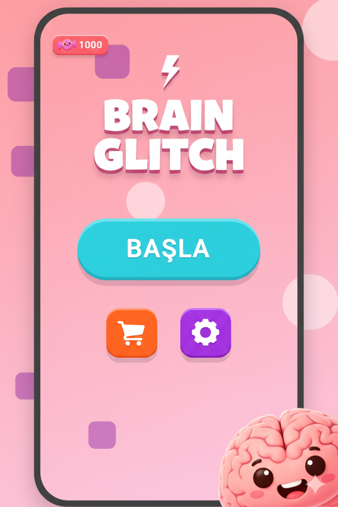
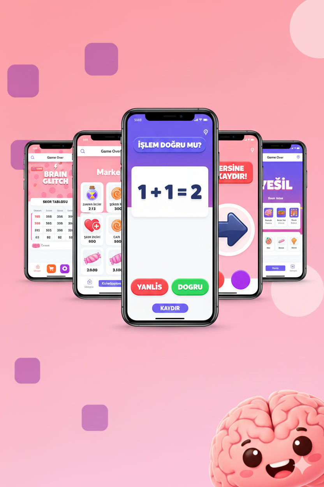
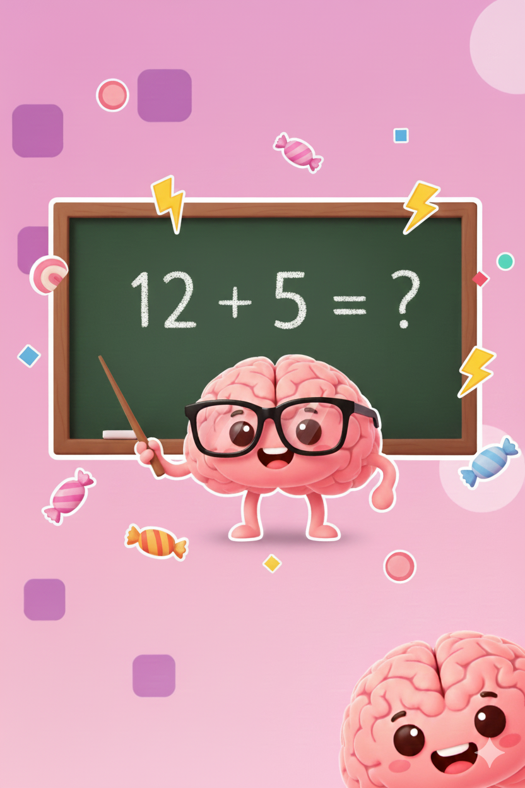
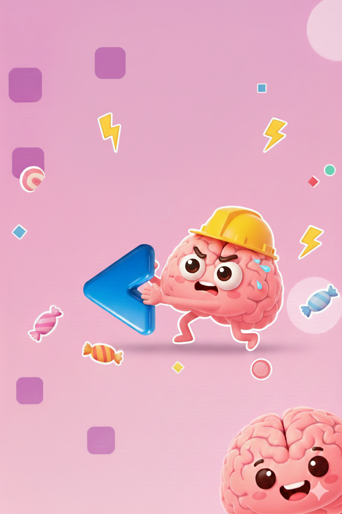
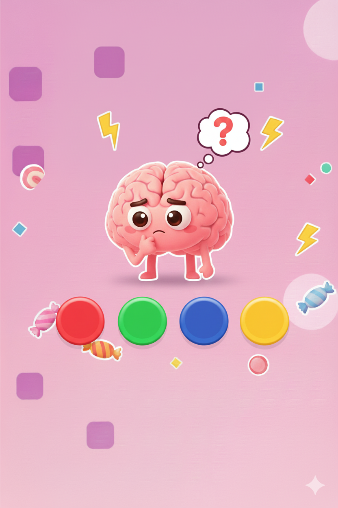

# 🧠 Brain Glitch (Candy Brain)

> **"Refleksini değil, beynini tamir et."**

---

## 🤖 AI-Native Project & Vibe Coding

**⚠️ BU PROJE HAKKINDA EN ÖNEMLİ BİLGİ:**

Bu oyunun kaynak kodları, mimarisi ve tüm mantıksal döngüleri, **tek bir satır kod manuel olarak yazılmadan**, tamamen **Yapay Zeka (Google Gemini)** ile iletişim kurularak geliştirilmiştir.

Bu proje, bir "kodlama" çalışmasından ziyade, ileri düzey **Prompt Engineering (İstem Mühendisliği)** ve **Vibe Coding** tekniklerinin bir ürünüdür. Geliştirici, yapay zekayı bir "Junior Developer" gibi yöneterek vizyonunu ürüne dönüştürmüştür.

* **Rol:** Proje Mimarı & Prompt Mühendisi
* **Geliştirici:** Yapay Zeka (LLM)
* **Geliştirici Adı:** Umut Nebi Çağan
* **Kurum:** Pamukkale Üniversitesi - Bilgisayar Mühendisliği (1. Sınıf)

---

## 🎮 Oyunun Mantığı ve Amacı

**Brain Glitch**, klasik sonsuz koşu oyunlarının aksine sadece reflekslerinizi değil, **bilişsel yeteneklerinizi** (Algı, Mantık, Duygu Kontrolü) test eden hiper-basit (hyper-casual) bir mobil oyundur.

### Nasıl Çalışır?
Oyun, beyninize sürekli farklı türde komutlar göndererek sizi "hata yapmaya" zorlar (Glitch). Amaç, süre bitmeden veya haklarınız tükenmeden doğru kararları vermektir.

### Görev Türleri (Mekanikler)
1.  **Refleks (Direction):** Okun gösterdiği yöne (veya tersine) kaydırma.
2.  **Algı (Color/Not Color):** "Yazı rengi mi?" yoksa "Yazının anlamı mı?" sorularına göre doğru rengi seçme (Stroop Testi mantığı).
3.  **Mantık (Math):** Ekranda beliren matematik işleminin doğru mu yanlış mı olduğunu anlık olarak bilme.
4.  **Duygu (Emoji):** Kelime (Örn: "MUTLU") ile gösterilen yüz ifadesinin eşleşip eşleşmediğini bulma.
5.  **Kontrol (Wait):** "BEKLE" komutu geldiğinde ekrana dokunmama dürtüsünü kontrol etme.

---

## 🌟 Temel Özellikler

### 🍬 Şeker Market (Sonsuz Kaydırma)
Oyuncular kazandıkları şekerlerle (oyun içi para) karakterlerini güçlendirebilir veya oyun modlarını değiştirebilirler.
* **Güçlendirmeler:** Can (İkinci Şans), Zaman İksiri, x2/x3 Şeker.
* **Mod İksirleri:** "Saf Refleks" veya "Saf Mantık" gibi iksirler, bir sonraki turda sadece o tür soruların gelmesini sağlar.

### 🧠 Beyin Onarımı (RPG Öğeleri)
Oyun sadece skor yapmak üzerine kurulu değildir. Hata yaptıkça düşen **Beyin Sağlığı (Brain Stability)** oranını, kazandığınız şekerlerle marketten "tamir etmeniz" gerekir.
* *Refleks Lobu, Mantık Lobu, Algı Lobu* gibi bölümleri ayrı ayrı geliştirebilirsiniz.

### 📅 Günlük Test
Her gün sadece 1 kez oynanabilen, oyuncunun o günkü zihinsel durumunu ölçen özel mod.

### 🌍 Diğer Özellikler
* **Çoklu Dil Desteği:** Türkçe (TR) ve İngilizce (EN).
* **Google AdMob:** Ödüllü reklamlar ile canlanma (Revive) ve geçiş reklamları.
* **Kalıcı Hafıza:** `shared_preferences` ile tüm ilerleme, envanter ve ayarlar cihazda saklanır.
* **Dinamik Arka Plan:** Sürekli akan, canlı ve şeker temalı animasyonlar.

---

## 🛠️ Teknik Altyapı

Bu proje **Flutter** kullanılarak geliştirilmiştir.

* **Dil:** Dart
* **State Management:** `setState` (Yapay zeka optimizasyonu ile temiz bir yapı).
* **Veri Saklama:** `shared_preferences`
* **Ses Yönetimi:** `audioplayers`
* **Reklam Ağı:** `google_mobile_ads`
* **Animasyonlar:** Custom Painters & Animation Controllers.

---

## 🚀 Kurulum

Projeyi yerel makinenizde çalıştırmak için:

1.  Depoyu klonlayın:
    ```bash
    git clone [https://github.com/KULLANICI_ADIN/REPO_ADIN.git](https://github.com/KULLANICI_ADIN/REPO_ADIN.git)
    ```
2.  Proje dizinine girin:
    ```bash
    cd brain-glitch
    ```
3.  Paketleri yükleyin:
    ```bash
    flutter pub get
    ```
4.  Çalıştırın:
    ```bash
    flutter run
    ```

---
## 📸 GÖRSELLER

<div style="display: flex; flex-direction: row;">
  
  
  
  
  
  
</div>

## 👨‍💻 Geliştirici Hakkında

**Umut Nebi Çağan**
*Pamukkale Üniversitesi - Bilgisayar Mühendisliği 1. Sınıf Öğrencisi*

Geleceğin yazılım dünyasında kodun "yazılan" değil, "tarif edilen" bir şey olacağına inanıyorum. Bu proje, bu vizyonun ilk adımıdır.

---
*© 2026 Brain Glitch. Powered by AI.*
